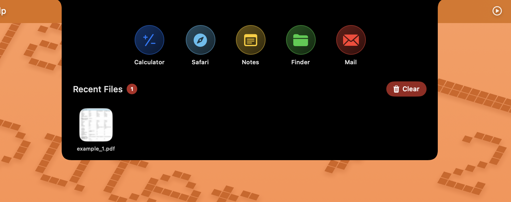

#  DNotch - Dynamic Island for macOS

**Transform your MacBook's notch into a powerful productivity hub & presently configured for 14inch macs**


[](https://swift.org)
[](https://developer.apple.com/macos/)
[](LICENSE)


> A Dynamic Island-style application that brings iPhone's innovative UI to your MacBook

&nbsp;
</img>
&nbsp; 

## ✨ Features

- **Smart Battery Integration** - Auto-expansion on charging with live percentage
- **File Management** - Drag & drop up to 5 files with instant previews
- **Quick App Launcher** - One-click access to essential apps
- **Intelligent States** - Minimal, hovered, and expanded modes
- **Performance Optimized** - Smooth animations with efficient memory usage

&nbsp; 




&nbsp; 


## 🛠️ Tech Stack

- **Swift 5.9+** with SwiftUI + AppKit
- **AVFoundation** for media previews
- **IOKit** for battery monitoring
- **Swift 6** concurrency ready

## 🚀 Quick Start
```
git clone https://github.com/YOUR_USERNAME/DNotch.git
cd DNotch

open DNotch.xcodepro
Press `⌘ + R` to build and run!
```

## 💡 Usage

1. **Hover** over notch area to reveal interface
2. **Drag files** for instant previews and quick access
3. **Click apps** for one-touch launching
4. **Right-click files** for context menu


## 🐛 Known Issues

- Occasional 5-second drag delay (investigating)
- High memory with large video files

## License

MIT License - see [LICENSE](LICENSE) file for details.

## Support

- ⭐ Star this repository
- 🐛 Report issues
- 💡 Suggest features
- 🔄 Share with others

---

<div align="center">

**Made with ❤️ for macOS**

</div>
